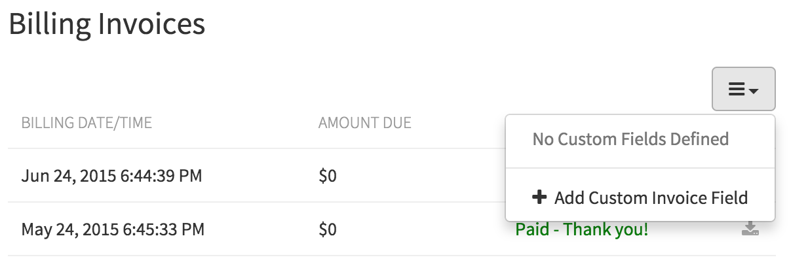
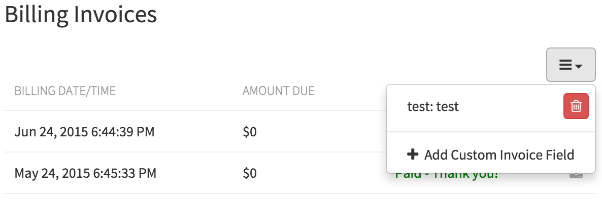

Invoices provided by Quay.io try to provide as much information as possible.
However, it may be necessary to include extra information for regulations such as Value Added Tax (VAT).
In order to solve this problem, Quay.io supports the ability to automatically customize invoices by adding custom fields and their contents.

### Adding new data

Navigate to the _Billing Invoices_ tab of an Organization View (`https://quay.io/organization/YOURORG?tab=invoices`).
In the top-right corner of the page, click on the drop-down as pictured below.
Select "Add Custom Invoice Field" and fill in the subsequent modal dialog with the name of the field and its value.
Repeat this for as many values as required (addresses will likely need to be split into multiple fields).
Now clicking on the download button (<i class="fa fa-download"></i>) for an invoice will produce a new invoice containing all of the new custom information.

  

### Removing data

Navigate to the _Billing Invoices_ tab of an Organization View (`https://quay.io/organization/YOURORG?tab=invoices`).
In the top-right corner of the page, click on the drop-down as pictured below.
Click the trash can icon next to the custom field that should be removed.

  

