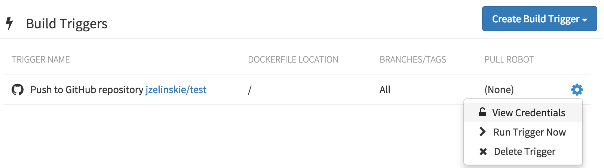

[Git submodules](https://git-scm.com/docs/git-submodule) are a popular way for one git repository to _vendor_ dependencies on other git repositories.

Quay.io supports the ability to build repositories that use submodules, however some manual setup is required to use this feature.
Git Triggers make use of SSH public keys to gain access to the source repository. Quay.io will create and add these keys automatically when the trigger is setup.
This will work perfectly fine in most cases, however these keys will not have access to **private git submodule repositories**.

### Finding the SSH Public Key for a Trigger

On Quay.io, navigate to the <i class="tab-icon fa fa-tasks"></i>Builds tab of the repository and select _View Credentials_ from the existing Git Trigger's dropdown.

  

A modal window will appear with a copyable version of the SSH public key.

### Private submodules under Bitbucket, GitLab

The public key must be set as a deploy key for **each of the private submodules' repositories** through the [Bitbucket](https://confluence.atlassian.com/display/BITBUCKET/Use+deployment+keys) or [GitLab](http://doc.gitlab.com/ce/ssh/README.html#deploy-keys) website.

### Private submodules under GitHub

Normally, one would add the public key as a deploy key for each of the private submodule's repositories through the git provider's website.
However, GitHub does not allow duplicate deploy keys to exist, even across repositories.
The only workaround requires that **the key be removed from its repository and moved to a user that has access to the repository.**
This may be a security concern, so it is recommended to create a brand new GitHub user and only giving them read access to those specific repositories.
For GitHub, this is generally safer than using repository deploy keys, as they provide both read and write access.
