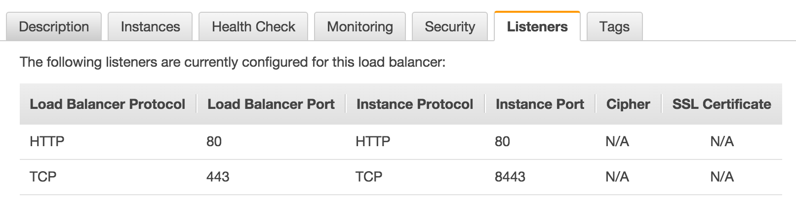

Running an enterprise instance of Quay.io behind a load balancer is often desired for large installations.
However, simply putting a load balancer in front of the Quay.io container has some unintended consequences:

 * all logged IP addresses will be the IP of the load balancer
 * since the TLS-termination is done by the container, you can't use both a load balancer and HTTPS.

These issues can be avoided through the use of [Proxy Protocol](http://www.haproxy.org/download/1.5/doc/proxy-protocol.txt) which is exposed by the container on **port 8443**.
Remember to execute the container with the `-p 8443:8443` flag on the `docker run` command to expose this port.

### Load Balancer Requirements

Load balancer requirements include:

* TCP Forwarding
* Proxy Protocol forwarding

| Software | TCP Forwarding | Proxy Protocol |
| -------- | :------------: | :------------: |
| HAProxy  |        ✓       |       ✓        |
| ELB      |        ✓       |       ✓        |
| nginx    |        ✓       |       x        |

Feel free to submit more entries to this table via a Pull Request on GitHub.

#### Setting up Amazon Elastic Load Balancer

Proxy Protocol is officially supported by Amazon ELB and can be enabled by following [these instructions](https://docs.aws.amazon.com/ElasticLoadBalancing/latest/DeveloperGuide/enable-proxy-protocol.html) found in Amazon's documentation.

After an ELB has been created with Proxy Protcol enabled, the listeners must be configured to forward traffic to the Quay.io container.
When properly configured, the Listeners tab for the ELB should appear like so:

  

After the listeners have been configured, the health checking endpoint needs to be configured to use the previously unused **port 443**.
When properly configured, the Listeners tab for the ELB should appear like so:

  

