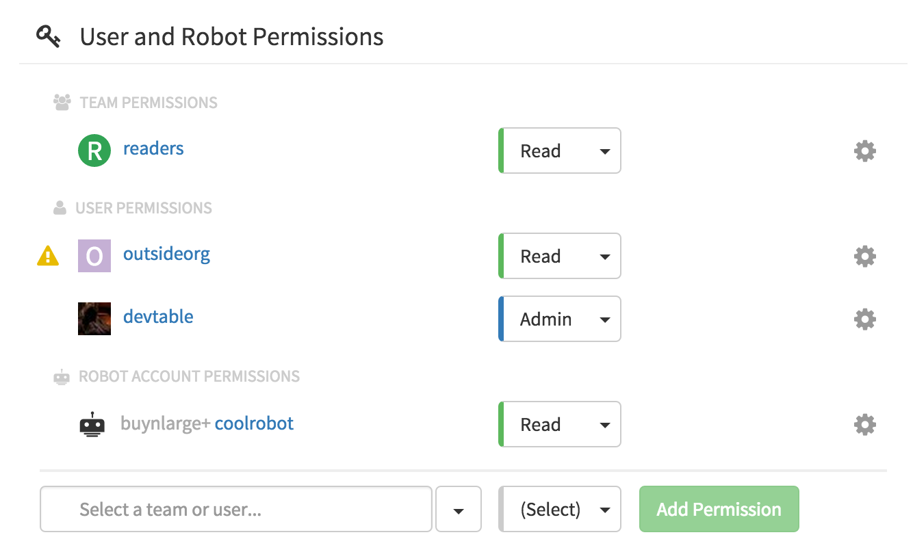

Repository permissions define which users, [robot accounts](/glossary/robot-accounts.html) and [teams](/glossary/teams.html) have access to a repository for pulling, pushing and administrating. To view and modify permissions for a repository, click the <i class="tab-icon fa fa-gear"></i>Settings tab in the [Repository View](/guides/repo-view.html).

Note: viewing and changing permissions requires **repository admin permission**.

### Adding a new permission

A new permission can be added to the repository by choosing an entity (user, robot, team) on the bottom row, choosing the permission for the new entity, and then clicking the "Add Permission" button.

### Changing a permission

To change the permission for an existing entity (user, robot, team) on the repository, click the permission button to the right of the entity, and choose the new permission.

### Revoking permission

To remove a permission for an entity (user, robot, team), click the <i class="fa fa-gear"></i> icon next to the entity and choose "Delete Permission".

### Why does a <i class="fa fa-warning" style="color: #E8BB03; margin-right: 4px;"></i>icon appear next to a user?

The triangle icon means that the user has permission on the repository, but is not a member of that repository's [Organization](glossary/organization.html).
