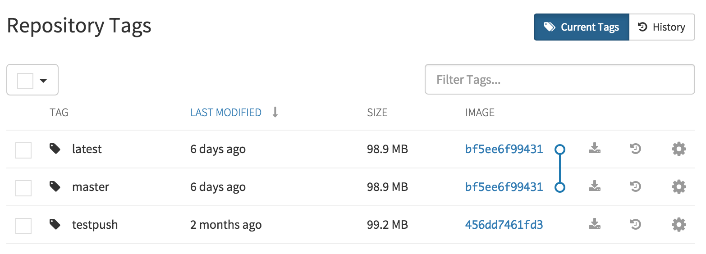

## Viewing and modifying tags

The tags of a repository can be viewed and modified in the tags panel of the repository page, found by clicking on the <i class="fa fa-tags tab-icon"></i>Tags tab.

### Visualize tags

To visualize multiple tags in a tree format, check the tags you are interested in viewing and click the "Visualize Tags" button that appears next to the top checkbox.

### Adding a new tag to an tagged image

A new tag can be added to an tagged image by clicking on the <i class="fa fa-gear"></i> icon next to the tag and choosing "Add New Tag". Quay.io will confirm the addition of the new tag to the image.

### Moving a tag

Moving a tag to a different image is accomplished by performing the same operation as adding a new tag, but giving an existing tag name. Quay.io will confirm that you want the tag moved, rather than added.

### Deleting a tag

A specific tag and all its images can be deleted by clicking on the <i class="fa fa-gear"></i> icon and choosing "Delete Tag". This will delete the tag and any images unique to it. Images will not be deleted until all tags sharing them are deleted.

### Viewing tag history and going back in time

#### Viewing tag history

To view the image history for a tag, click on the <i class="fa fa-history"></i> icon. The menu shown will display each image to which the tag pointed in the past and when it pointed to that image.

#### Going back in time

To revert the tag to a previous image, simply click on the image name.