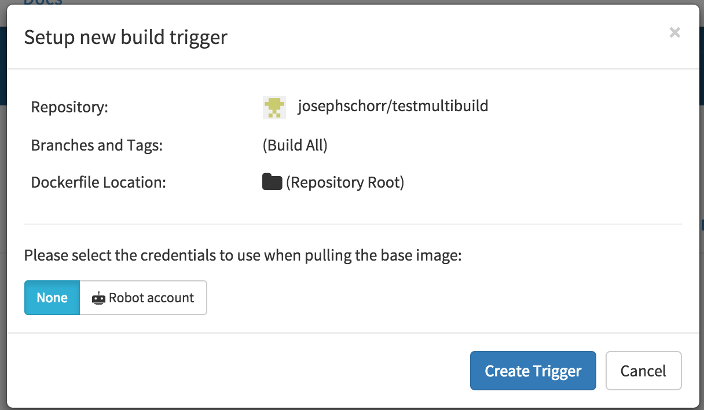
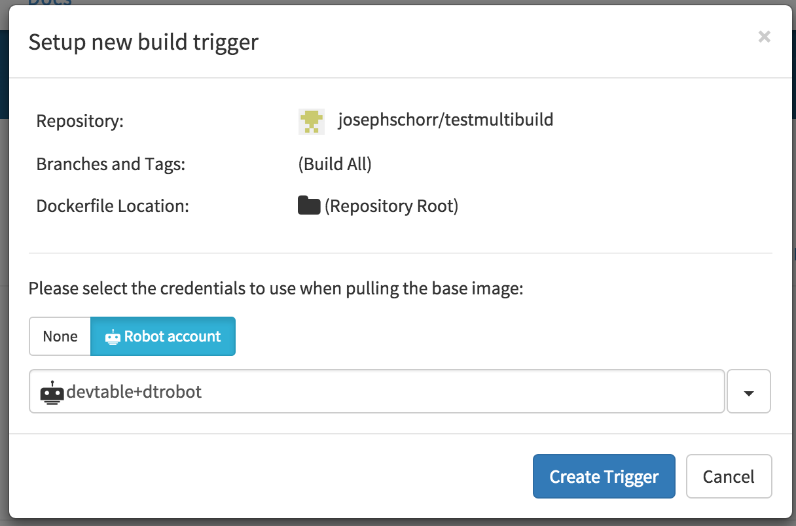

Attempting to use a private base image as the `FROM` line in a [Build Trigger](/glossary/build-trigger.html) results in a 403 error.

### Robot account credentials are required

In order to use a private base image as the `FROM` line in a [Build Trigger](/glossary/build-trigger.html), credentials for a [Robot Account](/glossary/robot-accounts.html) with *read-access to the private image* must be specified when setting up the build trigger.

#### Specifying robot account credentials

A robot account to use to pull the base image can be chosen in the build trigger setup dialog before the trigger is created:

    

Select the **Robot Account** option for the credentials to use, and then choose a robot account to use:

    

