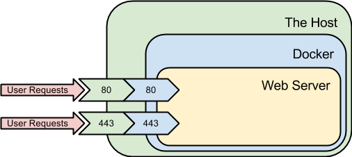

### Introduction

At Quay.io we are firm believers in Linux containers, after all, we have built our business around them. It is therefore natural that we use Docker extensively in our own infrastructure. We believe that using Docker and Quay.io greatly simplifies the task of deploying applications to production; in fact, we ourselves host the official Quay.io images on Quay.io itself, and deployment is done via a Docker pull and run. In this article we will discuss how we deploy Quay.io, how we achieve zero downtime without switching hosts on each deployment, and an open source tool we wrote called [Gantryd](https://github.com/DevTable/gantryd) that simplifies this process significantly.

### Using Docker in production

Conceptually, the idea of running a stateless service under Docker is a pretty simple one. Instead of running services on a machine directly, one simply takes their current stack and runs the same exact processes, the same exact way, inside a container. To expose the network interface for those services, one then uses the port mapping functionality of the `docker run` command to just forward those ports (typically 80 and 443 for HTTP) to the parent host and, to the outside world, it is as if Docker isn't even there.


<div class="article-image">
  <p>Your basic "run webserver under Docker" setup</p>
  
</div>

This simple yet straightforward model can take you pretty far, as it simply wraps any existing service or server inside a Docker container without any changes under the hood. To build upon it, you can run other services on the box, and they can all talk to one another via their Docker assigned IP addresses or [links](https://docs.docker.com/userguide/dockerlinks). If you have upstream components which are capable of working around downtime in a single node, it is even possible to upgrade the containers by taking them out of service, removing them, and restarting them, which works especially well if your web server can finish up its remaining requests and terminate gracefully when you tell your container to stop.

### A slightly more complex world

Sadly, this simple model does not work if any of the above assumptions are violated. At Quay.io, we service some very long lived requests. For example, when a user is uploading a Docker image (which can exceed a few gigabytes in size), the upload process may take several minutes to complete. Shutting down our existing Docker container to perform an upgrade (which we try do several times a day), was a non-starter, as it would interrupt these users during a critical time.

To give some idea of the difficulties of this problem: In the past, we used to handle this in one of two ways. For simple updates, we made use of the in-place restart functionality of our web servers, which usually entailed sending the HUP signal to the master processes. On the other hand, if we needed to change the version of the server software, upgrade some dependencies on the box, or any larger change, we were forced to spin up an _entire new cluster_ using the new configuration, switch the clusters using DNS, and then when there were no more active connections on the old cluster, shut it down... all manually.

Thanks to cloud management tools, this wasn't the horrible mess that it could have been if we were doing it totally manually, but it was far from ideal. As a result, we needed to find a new solution, one that would ideally leverage our knowledge of Docker and its abilities to solve this problem in a fast and simple manner.

### Docker and HAProxy to the rescue

One of the main advantages of Docker is the ability to run different versions of the same software on the same box. By skipping the port mapping step when running our containers, we realized that we were able to run several versions of Quay.io on the same box on separate Docker assigned virtual IP addresses. For example, with three versions of our container running on the same box, we were able to have web servers listening on `172.17.0.2:80`, `172.17.0.3:80`, and `172.17.0.4:80`. In order to have different traffic running to each of these different containers running simultaneously, we turned to our old friend HAProxy.

[HAProxy](http://www.haproxy.org/) is a web proxy and load balancer that allows you to change the configuration, restart the process, and (most importantly) have the old process die automatically when there is no more traffic running through it. In our newly designed system, whenever we start a new version of our container, we tell HAProxy to direct all new traffic to the new container while maintaining all existing connections and transfers in progress. This allows us to migrate all new users to our new code immediately, without interrupting any usage of our older version(s).

With HAProxy in place, our new architecture looks more like this:

<div class="article-image"></div>

Great! So now we can spin up new containers, and the old ones won't get any more traffic. Problem solved, right?

### Automatic everything

While the above solution works, manually editing HAProxy configs is a tedious and error prone task (the type of task not really suited for a human). Furthermore, once our older containers are no longer getting traffic, they are still waiting there, taking up resources, waiting for a request which will never come.

### Enter Gantryd

To resolve these remaining issues, we wrote a piece of software which is capable of inspecting running containers, generating the HAProxy config, monitoring the traffic to draining container instances, and terminating them when there is no more traffic.

[Gantryd](https://github.com/DevTable/gantryd) uses a JSON configuration block which describes the different components of your service. It contains information about how to run them, which ports they expose, which host volumes they need to map, and how to health check the containers to make sure they're ready and healthy. Here is our config file from our production Quay.io deployment:

```json
{
  "components": [
    {
      "bindings": [
        {
          "external": "/home/ubuntu/quayconfig/production",
          "volume": "/conf/stack"
        },
        {
          "external": "/mnt/logs",
          "volume": "/mnt/logs"
        }
      ],
      "healthChecks": [
        {
          "kind": "https",
          "path": "/status",
          "port": 443
        }
      ],
      "name": "quay",
      "ports": [
        {
          "container": 443,
          "external": 443
        },
        {
          "container": 80,
          "external": 80
        }
      ],
      "readyChecks": [
        {
          "kind": "https",
          "path": "/status",
          "port": 443
        }
      ],
      "readyTimeout": 100000,
      "repo": "quay.io/quay/quay",
      "tag": "latest"
    }
  ]
}
```

As you can see, there's really not too much to it. We point out to _gantry_ that we're using the container `quay.io/quay/quay`, and that it exposes ports 443 and 80 for HTTPS and HTTP traffic respectively. We map in some volumes which are specific to our image, we let it know how to health check, and we give it a health check timeout.

Then, whenever we need to spin up a new version of our container and drain the old one(s), we run the following command:

```
sudo gantry.py production.json update quay
```

If the new version of the container does not pass its health checks before the timeout has expired, the existing container is left in service and the user is notified.

### Distributed Gantryd

Logging in to each host and running the gantry commands is still painful of course, which is why we also have written a version of Gantryd which uses [etcd](https://github.com/coreos/etcd) to coordinate Gantry commands across an entire fleet. Getting an etcd cluster set up in a repeatable way is a different task, and is outside of the scope of this article.

### Draining Servers like a Boss

Hopefully now you have some idea of how you can setup the hosts in your cluster to migrate connections between different versions of a Docker container, and you understand how you can use this to build a cluster which can continually serve traffic without any downtime for upgrades. If you have any questions or comments, feel free to contact us at [support@quay.io](mailto:support@quay.io). If you're ready to get started, you can start a [free trial](https://quay.io/plans) now.
